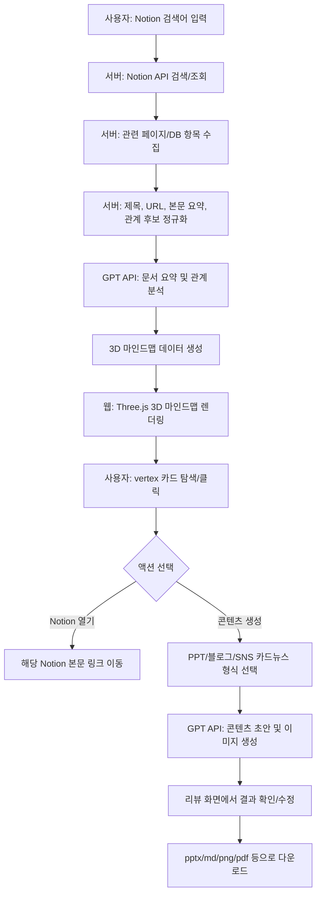

# MVP

## 1. 제품 한 줄 정의

사용자의 Notion 데이터를 검색하고 AI로 요약한 뒤, 웹에서 Three.js 기반 3D 마인드맵으로 시각화하며, 선택한 마인드맵 내용을 바탕으로 PPT 발표 자료, 블로그 글, 인스타그램 카드뉴스 이미지를 생성하고 다운로드할 수 있는 서비스.

## 2. 핵심 목표

- 사용자의 Notion 페이지와 데이터베이스를 검색해 관련 문서를 찾는다.
- 검색된 Notion 문서를 카드형 vertex로 구성된 3D 마인드맵으로 보여준다.
- 각 vertex 카드에는 Notion 데이터 제목과 한 줄 요약을 표시한다.
- vertex 카드를 클릭하면 해당 Notion 본문 링크로 바로 이동한다.
- 사용자는 마인드맵에서 원하는 노드 또는 노드 묶음을 선택해 콘텐츠 생성을 요청할 수 있다.
- GPT API를 통해 PPT 발표, 블로그 글, 인스타그램 카드뉴스용 결과물을 생성한다.
- 생성된 결과물은 사용자가 먼저 리뷰한 뒤, 원하는 파일 형식으로 다운로드한다.
- UI는 Next.js, TailwindCSS, shadcn/ui 기반으로 일관되게 구현한다.

## 3. 문제 정의

Notion에는 프로젝트 기획, 회의록, 자료 조사, 아이디어, 업무 문서가 계속 쌓인다. 하지만 사용자는 원하는 내용을 찾은 뒤에도 문서 간 관계를 직접 파악해야 하고, 발표 자료나 블로그 글, SNS 카드뉴스로 다시 가공하는 데 많은 시간을 사용한다.

이 MVP는 Notion을 단순 검색 결과 목록이 아니라 3D 지식 맵으로 보여준다. 사용자는 문서의 관계를 시각적으로 탐색하고, 필요한 노드를 선택해 목적에 맞는 콘텐츠로 즉시 변환할 수 있다.

## 4. 핵심 사용자

- Notion으로 프로젝트 문서, 회의록, 기획서를 관리하는 사용자
- Notion 자료를 발표 자료, 블로그 글, SNS 콘텐츠로 자주 변환하는 사용자
- 여러 문서 사이의 관계를 한눈에 보고 싶은 PM, 기획자, 디자이너, 개발자
- Obsidian graph view처럼 지식 구조를 탐색하고 싶은 사용자

## 5. MVP 사용자 흐름



## 6. MVP 포함 범위

- Notion Internal Connection 기반 연동
- 사용자의 Notion 페이지 또는 데이터베이스 검색
- 검색 결과의 페이지 제목, URL, 본문 일부, 속성 수집
- Notion 본문 블록 재귀 수집
- 검색 결과를 AI에 전달하기 전 서버에서 정규화
- GPT API 기반 한 줄 요약 생성
- GPT API 기반 문서 관계 분석
- Three.js 기반 3D 마인드맵 렌더링
- 카드 형태의 vertex UI
- vertex 카드 클릭 시 Notion 원문 링크 이동
- 마인드맵 노드 선택 기능
- 선택 노드 기반 콘텐츠 생성
- PPT 발표 자료 초안 생성
- 블로그 글 초안 생성
- 인스타그램 카드뉴스 이미지 생성
- 생성 결과 리뷰 단계
- 파일 형식별 다운로드 선택지 제공
- TailwindCSS, shadcn/ui 기반 UI

## 7. MVP 제외 범위

- Notion에 생성 결과를 다시 저장
- OAuth 기반 다중 사용자 설치
- 실시간 Notion 변경 감지
- 협업 편집 기능
- 카드뉴스 게시 예약
- 실제 인스타그램 업로드 자동화
- 복잡한 발표 애니메이션 편집기
- 전체 워크스페이스를 무제한으로 색인하는 검색 엔진
- 결제, 요금제, 관리자 콘솔

## 8. 주요 화면

### 8.1 Notion 검색 화면

- 검색어 입력
- 검색 범위 선택: page, database, all
- 검색 실행 버튼
- 검색 상태 표시
- 검색 결과 개수 표시
- 최근 검색어 또는 최근 마인드맵 표시

### 8.2 3D 마인드맵 화면

- Three.js canvas 기반 전체 화면형 graph view
- vertex 카드: 제목, 한 줄 요약, 타입, 관련 키워드 표시
- edge: 문서 간 관계 표시
- zoom, pan, rotate interaction
- 중심 노드로 이동
- 선택 노드 강조
- 노드 그룹 필터링
- 미니맵 또는 현재 선택 정보 패널

### 8.3 Vertex 상세 패널

- Notion 제목
- 한 줄 요약
- 핵심 bullet
- 키워드
- 관련 노드 목록
- 원문 열기 버튼
- 콘텐츠 생성에 포함하기 toggle

### 8.4 콘텐츠 생성 화면

- 선택한 노드 목록
- 생성 형식 선택
  - PPT 발표
  - 블로그 글
  - 인스타그램 카드뉴스
- 톤 선택
  - 전문적
  - 친근한
  - 마케팅형
  - 보고서형
- 분량 선택
- 생성 실행 버튼

### 8.5 리뷰 및 다운로드 화면

- 생성 결과 미리보기
- 텍스트 수정
- 이미지 재생성
- 슬라이드/카드 순서 변경
- 다운로드 형식 선택
  - PPT 발표: `pptx`, `pdf`
  - 블로그 글: `md`, `pdf`
  - SNS 카드뉴스: `png`, `pdf`

## 9. 3D 마인드맵 요구사항

### 9.1 렌더링

- Three.js를 사용해 3D graph를 구현한다.
- Obsidian graph view를 레퍼런스로 하되, vertex는 단순 점이 아니라 카드형 UI로 표현한다.
- WebGL scene 안에서 노드 위치, edge 라인, 카메라 이동을 관리한다.
- 노드 수가 많을 때도 최소한의 interaction이 유지되도록 level of detail를 적용한다.

### 9.2 Vertex 카드

각 vertex는 다음 정보를 가진다.

```json
{
  "id": "node_1",
  "notionPageId": "page-id",
  "title": "서비스 기획 회의록",
  "summary": "AI 화면 정리 API의 핵심 범위와 구현 순서를 정리한 문서입니다.",
  "url": "https://www.notion.so/...",
  "type": "page",
  "keywords": ["AI", "Notion", "MVP"],
  "group": "product"
}
```

카드 표시 규칙:

- 제목은 1줄 또는 2줄까지 표시한다.
- 한 줄 요약은 짧게 표시하고 넘치면 말줄임 처리한다.
- 카드에는 Notion 타입 또는 그룹을 구분할 수 있는 badge를 표시한다.
- 선택된 카드는 색상, scale, glow 등으로 강조한다.
- hover 시 더 자세한 요약을 tooltip 또는 side panel로 보여준다.

### 9.3 Edge 관계

edge는 다음 기준으로 생성한다.

- 같은 database에 속한 페이지
- 같은 키워드를 공유하는 페이지
- 본문에서 서로를 언급하는 페이지
- GPT API가 관계가 있다고 판단한 페이지

```json
{
  "id": "edge_1",
  "from": "node_1",
  "to": "node_2",
  "label": "같은 프로젝트",
  "weight": 0.78
}
```

### 9.4 Interaction

- vertex click: Notion 원문 링크로 이동하거나 상세 패널을 연다.
- command/cmd + click 또는 별도 버튼: 새 탭에서 Notion 링크를 연다.
- vertex select: 콘텐츠 생성 대상에 포함한다.
- drag: 노드 위치를 임시 조정한다.
- double click: 카메라를 해당 노드 중심으로 이동한다.
- search in graph: 특정 노드를 찾아 카메라를 이동한다.

## 10. 콘텐츠 생성 요구사항

### 10.1 공통 생성 흐름

1. 사용자가 마인드맵에서 노드 또는 노드 그룹을 선택한다.
2. 생성 형식을 선택한다.
3. 서버가 선택 노드의 원문 요약과 핵심 구조를 정리한다.
4. GPT API가 형식에 맞는 콘텐츠 초안을 만든다.
5. 이미지가 필요한 형식은 이미지 생성 API를 호출한다.
6. 사용자는 리뷰 화면에서 결과를 확인한다.
7. 사용자는 원하는 파일 형식으로 다운로드한다.

### 10.2 PPT 발표 생성

입력:

- 선택된 Notion 노드
- 발표 목적
- 예상 발표 시간
- 청중 유형
- 톤

출력:

- 발표 제목
- 슬라이드 구성
- 각 슬라이드 제목
- 각 슬라이드 핵심 bullet
- 발표자 노트
- 시각 자료 프롬프트

다운로드:

- `pptx`
- `pdf`

### 10.3 블로그 글 생성

입력:

- 선택된 Notion 노드
- 글 목적
- 대상 독자
- 톤
- 글 길이

출력:

- 제목 후보
- SEO description
- 본문 Markdown
- 소제목 구조
- 요약문
- 태그

다운로드:

- `md`
- `pdf`

### 10.4 인스타그램 카드뉴스 생성

입력:

- 선택된 Notion 노드
- 카드 수
- 톤
- 브랜드 컬러 또는 스타일
- 이미지 비율

출력:

- 카드별 카피
- 카드별 이미지 프롬프트
- 카드별 생성 이미지
- 전체 카드뉴스 PDF

다운로드:

- `png`
- `pdf`

## 11. 리뷰 단계 요구사항

생성된 콘텐츠는 즉시 다운로드하지 않고 반드시 리뷰 단계를 거친다.

리뷰 단계에서 가능한 작업:

- 결과 미리보기
- 텍스트 직접 수정
- 톤 변경 후 재생성
- 특정 슬라이드/카드만 재생성
- 카드뉴스 이미지 재생성
- 포함 노드 추가/제외
- 최종 다운로드 형식 선택

리뷰 상태값:

- `draft`
- `reviewing`
- `approved`
- `exporting`
- `exported`
- `failed`

## 12. API 설계

### 12.1 Notion 검색

```http
POST /api/notion/search
```

Request:

```json
{
  "query": "AI 화면 정리",
  "scope": "all",
  "limit": 20
}
```

Response:

```json
{
  "searchId": "search_123",
  "items": [
    {
      "id": "page-id",
      "title": "AI 화면 정리 API",
      "url": "https://www.notion.so/...",
      "type": "page",
      "lastEditedTime": "2026-05-30T00:00:00.000Z"
    }
  ]
}
```

### 12.2 마인드맵 생성

```http
POST /api/mindmaps
```

Request:

```json
{
  "searchId": "search_123",
  "itemIds": ["page-id-1", "page-id-2"]
}
```

Response:

```json
{
  "mindmapId": "mindmap_123",
  "status": "processing"
}
```

### 12.3 마인드맵 조회

```http
GET /api/mindmaps/{mindmapId}
```

Response:

```json
{
  "mindmapId": "mindmap_123",
  "status": "completed",
  "nodes": [
    {
      "id": "node_1",
      "notionPageId": "page-id",
      "title": "AI 화면 정리 API",
      "summary": "Notion 데이터를 AI로 구조화해 화면에 보여주는 API 기획입니다.",
      "url": "https://www.notion.so/...",
      "type": "page",
      "keywords": ["Notion", "AI", "API"],
      "position": {
        "x": 0,
        "y": 0,
        "z": 0
      }
    }
  ],
  "edges": [
    {
      "id": "edge_1",
      "from": "node_1",
      "to": "node_2",
      "label": "관련 주제",
      "weight": 0.72
    }
  ]
}
```

### 12.4 콘텐츠 생성 요청

```http
POST /api/generations
```

Request:

```json
{
  "mindmapId": "mindmap_123",
  "nodeIds": ["node_1", "node_2"],
  "format": "ppt",
  "tone": "professional",
  "options": {
    "slideCount": 8,
    "audience": "internal team",
    "durationMinutes": 10
  }
}
```

Response:

```json
{
  "generationId": "generation_123",
  "status": "draft"
}
```

### 12.5 생성 결과 조회

```http
GET /api/generations/{generationId}
```

Response:

```json
{
  "generationId": "generation_123",
  "format": "ppt",
  "status": "reviewing",
  "preview": {
    "title": "AI 화면 정리 서비스 제안",
    "slides": []
  },
  "assets": []
}
```

### 12.6 Export

```http
POST /api/generations/{generationId}/export
```

Request:

```json
{
  "fileType": "pptx"
}
```

Response:

```json
{
  "exportId": "export_123",
  "status": "exporting"
}
```

## 13. 데이터 구조

### 13.1 Normalized Notion Item

```json
{
  "id": "page-id",
  "title": "서비스 기획",
  "url": "https://www.notion.so/...",
  "type": "page",
  "properties": {},
  "plainText": "정규화된 본문 텍스트",
  "headings": ["문제 정의", "MVP 범위"],
  "keywords": ["Notion", "AI", "마인드맵"]
}
```

### 13.2 Mindmap Node

```json
{
  "id": "node_1",
  "sourceId": "page-id",
  "title": "서비스 기획",
  "summary": "Notion 데이터를 3D 마인드맵과 콘텐츠로 변환하는 서비스입니다.",
  "url": "https://www.notion.so/...",
  "keywords": ["Notion", "Three.js", "GPT"],
  "group": "product",
  "position": {
    "x": 12,
    "y": -4,
    "z": 8
  }
}
```

### 13.3 Generation Draft

```json
{
  "generationId": "generation_123",
  "format": "instagram_cards",
  "sourceNodeIds": ["node_1", "node_2"],
  "status": "reviewing",
  "content": {
    "title": "Notion 지식 맵 만들기",
    "cards": []
  },
  "downloadOptions": ["png", "pdf"]
}
```

## 14. 기술 스택

- Framework: Next.js App Router
- Language: TypeScript
- Styling: TailwindCSS
- UI: shadcn/ui
- 3D: Three.js
- 3D React binding: React Three Fiber
- 3D controls: Drei
- Client state: Zustand
- Server state/query: TanStack Query
- Validation: zod
- Icons: lucide-react
- AI: GPT API
- Image generation: GPT 이미지 생성 API
- PPT export: pptxgenjs
- PDF export: React PDF 또는 서버 PDF 렌더러
- Markdown export: server-side file generation
- PNG export: canvas capture 또는 html-to-image

### 14.1 상태 및 Query 관리

Zustand는 사용자의 현재 화면 조작 상태와 3D 마인드맵 interaction 상태를 관리한다.

Zustand 관리 대상:

- 현재 선택된 mindmap ID
- 선택된 node IDs
- hover 중인 node ID
- focus 된 node ID
- 카메라 모드와 graph interaction mode
- 필터, 검색어, 그룹 표시 여부
- 콘텐츠 생성 패널 open/close 상태
- 리뷰 화면의 로컬 편집 draft

TanStack Query는 서버에서 가져오는 데이터와 비동기 mutation 상태를 관리한다.

TanStack Query 관리 대상:

- Notion 검색 결과 query
- 마인드맵 생성 mutation
- 마인드맵 상세 조회 query
- 콘텐츠 생성 mutation
- 생성 결과 상세 조회 query
- export 요청 mutation
- export 상태 polling query
- 실패, 재시도, stale time, cache invalidation

책임 분리:

- 서버에서 가져오거나 서버에 변경을 요청하는 데이터는 TanStack Query로 관리한다.
- 사용자의 현재 선택, hover, panel, camera, local draft처럼 서버 저장 전 UI 상태는 Zustand로 관리한다.
- 같은 데이터를 Zustand와 TanStack Query에 중복 저장하지 않는다.
- mutation 성공 후 관련 query를 invalidate해 최신 서버 상태를 다시 가져온다.

## 15. 환경변수

```env
NOTION_TOKEN=secret_xxxxxxxxx
NOTION_VERSION=2026-03-11
OPENAI_API_KEY=sk_xxxxxxxxx
OPENAI_MODEL=your_text_model
OPENAI_IMAGE_MODEL=your_image_model
```

규칙:

- 첨부된 API 키는 서버 환경변수로만 설정한다.
- API 키는 클라이언트 번들에 포함하지 않는다.
- 프론트엔드는 `/api/*` route만 호출한다.

## 16. UI 규칙

- 전체 UI는 shadcn/ui 컴포넌트를 우선 사용한다.
- TailwindCSS utility class로 레이아웃과 spacing을 통일한다.
- 첫 화면은 랜딩 페이지가 아니라 검색과 3D 마인드맵 중심의 작업 화면이어야 한다.
- 3D canvas는 주요 화면 영역을 차지해야 하며 작은 미리보기 카드 안에 갇히지 않는다.
- 버튼에는 lucide-react 아이콘을 함께 사용한다.
- 검색, 필터, 생성 옵션은 좌측 또는 우측 패널로 정리한다.
- 마인드맵 vertex 상세 정보는 side sheet 또는 panel로 표시한다.
- 카드뉴스 리뷰 화면은 카드 단위 편집과 재생성이 쉬워야 한다.
- 버튼, badge, card, tabs, dialog는 shadcn/ui 기준으로 일관되게 사용한다.

## 17. 보안 및 데이터 정책

- Notion token과 GPT API key는 서버에만 저장한다.
- Notion 원문 전체를 클라이언트에 불필요하게 전달하지 않는다.
- 클라이언트에는 마인드맵 렌더링과 리뷰에 필요한 최소 데이터만 전달한다.
- Notion 원문 URL은 사용자가 클릭할 수 있도록 제공한다.
- export 파일은 생성 후 일정 시간만 접근 가능하게 한다.
- provider raw response와 stack trace는 사용자 응답에 포함하지 않는다.

## 18. 성공 기준

- 사용자가 Notion 검색어를 입력하면 관련 Notion 문서 목록이 나온다.
- 검색 결과를 기반으로 3D 마인드맵이 생성된다.
- 각 vertex가 카드 형태로 렌더링된다.
- 각 vertex 카드에 제목과 한 줄 요약이 표시된다.
- vertex 카드를 클릭하면 해당 Notion 원문 링크로 이동할 수 있다.
- 사용자가 마인드맵 노드를 선택해 콘텐츠 생성을 요청할 수 있다.
- PPT 발표 자료 초안이 생성되고 리뷰 화면에서 확인된다.
- 블로그 글 초안이 Markdown 형태로 생성된다.
- 인스타그램 카드뉴스 이미지가 생성되고 카드별 리뷰가 가능하다.
- 사용자가 결과물을 `pptx`, `md`, `png`, `pdf` 중 형식에 맞게 다운로드할 수 있다.
- 3D 마인드맵 interaction이 데스크톱 브라우저에서 부드럽게 동작한다.
- UI가 Next.js, TailwindCSS, shadcn/ui 기준으로 일관된다.

## 19. 개발 순서

1. Next.js App Router 프로젝트 구성
2. TailwindCSS, shadcn/ui, lucide-react 설정
3. Zustand store와 TanStack Query provider 설정
4. Notion Internal Connection 환경변수 설정
5. Notion 검색 API 구현
6. Notion 페이지/DB 본문 수집 및 정규화 구현
7. GPT API 기반 제목/한 줄 요약/키워드 추출 구현
8. GPT API 기반 관계 분석 및 edge 생성 구현
9. Three.js, React Three Fiber, Drei 기반 3D canvas 구현
10. 카드형 vertex 렌더링 구현
11. vertex click, select, focus interaction 구현
12. TanStack Query 기반 검색/마인드맵/생성/export query와 mutation 연결
13. Zustand 기반 node 선택, hover, focus, filter, panel 상태 연결
14. 마인드맵 상세 패널 구현
15. 콘텐츠 생성 옵션 UI 구현
16. PPT 발표 생성 파이프라인 구현
17. 블로그 글 생성 파이프라인 구현
18. 인스타그램 카드뉴스 이미지 생성 파이프라인 구현
19. 리뷰 화면 구현
20. export 및 다운로드 구현
21. 로딩, 실패, 빈 결과 상태 구현
22. 데스크톱/모바일 반응형 QA

## 20. MVP 이후 확장

- Notion OAuth 기반 다중 사용자 지원
- Notion 변경 감지 후 자동 마인드맵 갱신
- 팀별 공유 마인드맵
- 마인드맵에서 직접 노션 문서 편집
- 생성 결과를 Notion 페이지로 다시 저장
- 발표 템플릿/브랜드 템플릿 관리
- SNS 예약 발행
- 고급 graph clustering
- 로컬 graph cache와 빠른 재검색
